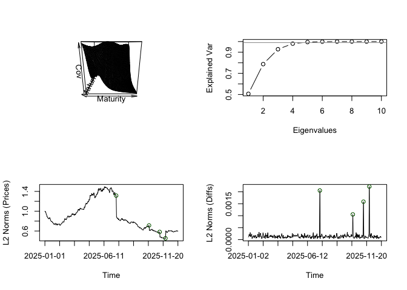

<!-- README.md is generated from README.Rmd. Please edit that file -->

# FDATSM

<!-- badges: start -->

The R package `FDATSM` provides tools for the statistical analysis of
realized covariations of difference returns and the term structure of
volatility in bond markets as introduced in the article [**Dynamically
Consistent Analysis of Realized Covariations in Term Structure
Models**](https://arxiv.org/abs/2406.19412) by [Dennis
Schroers](https://github.com/dschroers).

The package is designed to work with bond price data over a user-defined
time span (e.g., a quarter, a year, or a decade) and within a specified
upper bound for time-to-maturity (e.g. 5, 10, or 30 years). For accurate
results, the input data should be of daily resolution in both dimensions
— time and the time-to-maturity. This typically requires access to
smoothed discount or yield curves to ensure consistency across the term
structure. We demonstrate how to preprocess data appropriately
(e.g. when discount or yield curves are not available in a daily
resolution) in the context of two publicly available datasets of
smoothed yield curves.

The core output is a matrix of estimated truncated covariations of
difference returns. This matrix serves as an outlier-robust proxy for
the realized covolatility kernel of instantaneous forward curves.

<!-- badges: end -->

## Installation

You can install the development version of **FDATSM** from
[GitHub](https://github.com/dschroers/FDATSM) using the `devtools`
package:

``` r
#if not already installed:
# install.packages("devtools")

devtools::install_github("dschroers/FDATSM")
```

``` r
# Then load the package
library(FDATSM)
```

## Example: Simulated forward rates

We demonstrate the full analysis pipeline using simulated bond price
data.

### 1. Model Background

We simulate instantaneous forward rates $f_t(x)$. Corresponding bond
prices are given by $P_t(x)=\exp\left(-\int_0^x f_t(y)dy\right)$.

The forward rates dynamics are governed by the SPDE:

$$
df_t = \partial_x f_t\,dt + dX_t, \quad X_t = W_t^Q + J_t
$$

- $W^Q$: $Q$-Wiener process, where $Q$ is an integral kernel operator
  with kernel $q(x,y)= \exp(-10 (x-y)^2)$.  
- $J$: Compound Poisson process $J_t = \sum_{i=1}^{N_t}\chi_i$. $N$ is a
  Poisson process with intensity $\lambda=2$. $\chi\sim N(0, C)$ is
  Gaussian for an integral kernel operator $C$ with exponential kernel
  $c(x,y)\propto \exp(-x)\exp(-y)$. The kernel is normalized such that
  $\|c\|_{L^2([0,1]^2)}=1$.

To simulate from this model:

``` r

#Compute the Gaussian covariance kernel for the diffusion term
q <- Gaussian.cov(alpha=10, Years=2)

#Compute the exponential covariance kernel for the jump sizes
k <- Exponential.cov(Years=2)


# Simulate forward rate dynamics
set.seed(111)
SIM <- Simulator(n=365, q= q,rho=1, lambda = 2, k=k, f0 = numeric(dim(k)[1]))#creates 365 discount curve samples with maturities ranging from 1 to 365 days, and with a trivial initial forward curve


# Create a data frame with artificial dates
dates <- seq.Date(from = as.Date("2025-01-01"), by = "day", length.out = 365)
Sim.DF <- as.data.frame(SIM$Prices)
Sim.DF <- cbind(Date = dates, Sim.DF)
```

Now run the truncated covariation estimator:

``` r
Est <- truncated_covariation(x=Sim.DF, sumplot = TRUE)
```



### 2. Diagnostics

**Relative Error:** The relative MSE in Hilbert-Schmidt norm of our
truncated estimator for $q$ is

``` r
L2_HS_norm(Est$IV-q[1:365,1:365]*(365^2))/L2_HS_norm(q[1:365,1:365]*(365^2))
#> [1] 0.07014797
```

**Dimension of the term structure:** The measured number of factors to
explain 99% of the variation in the data is

``` r
which.max(Est$expl.var >.99)
#> [1] 5
```

which is the correct number of factors needed to explain 99% of the
variation as measured by $q$:

``` r
loads <- numeric(ncol(q[1:365,1:365]))
    expl.var <- cumsum(eigen(q[1:365,1:365])$values)/sum(eigen(q[1:365,1:365])$values)
which.max(expl.var >.99)
#> [1] 5
```

**Jump detection:**

The detected jump locations are

``` r
Est$locs
#> [1] "2025-07-16" "2025-10-14" "2025-11-12" "2025-11-28"
```

which coincide with the correct jump locations

``` r
dates[SIM$jump.locs]
#> [1] "2025-07-16" "2025-10-14" "2025-11-12" "2025-11-28"
```

## Examples: Application to Real Bond Market Data

We demonstrate the use of the package on real bond market data. This
section includes two examples beginning with a dataset provided by
Filipović, Pelger & Ye (2022), which contains U.S. Treasury yields in
daily resolution in the maturity and the time dimension. The second
analyzed dataset by Liu & Wu (2021) also contains U.S. Treasury yields
in daily resolution in the time dimension but a monthly resolution in
the maturity dimension, so reconstruction of a daily resolution is
necessary.

The following packages are used for data manipulation:

``` r
library(readxl)
library(readr)
library(lubridate)
#> 
#> Attache Paket: 'lubridate'
#> Die folgenden Objekte sind maskiert von 'package:base':
#> 
#>     date, intersect, setdiff, union
library(stringr)
library(dplyr)
#> 
#> Attache Paket: 'dplyr'
#> Die folgenden Objekte sind maskiert von 'package:stats':
#> 
#>     filter, lag
#> Die folgenden Objekte sind maskiert von 'package:base':
#> 
#>     intersect, setdiff, setequal, union
library(tidyr)
## basic example code
```

### Example 1: Daily Yield Curve Resolution (Filipović, Pelger, Ye, 2022)

We begin with a dataset provided by Filipović, Pelger & Ye (2022)
available on <https://www.discount-bond-data.org>. The data consist of
daily U.S. Treasury yields for each day to maturity up to a maximal
time-to-maturity, which are derived by a reproducing kernel Hilbert
space (RKHS) approach. For this example, we restrict attention to yields
with maturities up to 10 years (3650 days), and to the years 2005, 2006
and 2007.

``` r
df.fpy <- readr::read_csv("Data/Yields2005_2007_10max.csv")
#> Rows: 751 Columns: 3651
#> ── Column specification ────────────────────────────────────────────────────────
#> Delimiter: ","
#> dbl  (3650): MAX_DATA_TTM, 1, 2, 3, 4, 5, 6, 7, 8, 9, 10, 11, 12, 13, 14, 15...
#> date    (1): ...1
#> 
#> ℹ Use `spec()` to retrieve the full column specification for this data.
#> ℹ Specify the column types or set `show_col_types = FALSE` to quiet this message.
```

#### Data Preprocessing

The data are already provided in daily resolution in the maturity
dimension and, hence, do not need substantial preprocessing. However, we
need to transform the provided yields to bond prices via the formula
$p(x)=e^{-xy(x)}$ where $x$ is the time to maturity and $y(x)$ is the
corresponding yield. Since the yields were derived with a 365-day year
convention, the data are converted as follows:

``` r
#delete the metadata columns and convert yields to prices
price.df.fpy <- df.fpy[,-2]
for (i in 1:(ncol(price.df.fpy)-1)) {
  price.df.fpy[,1+i] <- exp(-(i/365)*price.df.fpy[,1+i])
}
```

Next, we select the start and end date for the periods in which we want
to compute the realized covariations. We do this for the years 2005,
2006 and 2007 separately.

#### Realized Measures

To derive the realized variation for the year 2005, we apply

``` r
FPY.price.df.2005 <- price.df.fpy[as.Date(price.df.fpy$...1) >= as.Date("2005-01-01") &
           as.Date(price.df.fpy$...1) <= as.Date("2005-12-31"),]

Est.2005.fpy <- truncated_covariation(x=FPY.price.df.2005)

#jump locations
Est.2005.fpy$locs
#> character(0)

#number of factors needed to explain 99% of the variation
which.max(Est.2005.fpy$expl.var[1:50]>.99)
#> [1] 11
```

No jumps were detected in 2005, although it is important to note that
the jump detection method cannot identify a jump on the first trading
day of the year due to the lack of prior-day data.

To derive the realized variation for the year 2006, we apply

``` r
FPY.price.df.2006 <- price.df.fpy[as.Date(price.df.fpy$...1) >= as.Date("2006-01-01") &
           as.Date(price.df.fpy$...1) <= as.Date("2006-12-31"),]

Est.2006.fpy <- truncated_covariation(x=FPY.price.df.2006, sumplot = TRUE)
```


``` r

#jump locations
Est.2006.fpy$locs
#> [1] "2006-06-30" "2006-07-03"

#number of factors needed to explain 99% of the variation
which.max(Est.2006.fpy$expl.var[1:50]>.99)
#> [1] 10
```

Jumps are detected at two consecutive dates possibly connected to fact
that the FED raised the federal funds rate by 0.25% on the day before.

To derive the realized variation for the year 2007, we apply

``` r

FPY.price.df.2007 <- price.df.fpy[as.Date(price.df.fpy$...1) >= as.Date("2007-01-01") &
           as.Date(price.df.fpy$...1) <= as.Date("2007-12-31"),]

Est.2007.fpy <- truncated_covariation(x=FPY.price.df.2007, sumplot = TRUE)
```


``` r

#jump locations
Est.2007.fpy$locs
#> [1] "2007-08-20" "2007-11-30" "2007-12-03"

#number of factors needed to explain 99% of the variation
which.max(Est.2007.fpy$expl.var[1:50]>.99)
#> [1] 10
```

Three jumps were detected which appear less extreme in magnitude, but
more so in shape.

The measured minimal numbers of linear noise factors are in all years
comparably high and suggest that at least 10 factors are needed to
explain a high amount (99%) of the covariation of difference returns.

### Example 2: Monthly yield curve resolution (Liu, Wu, 2021)

We next consider a second dataset provided by Liu & Wu (2021) based on
local polynomial smoothing available on
<https://sites.google.com/view/jingcynthiawu/yield-data>. These smooth
yield curves are derived from the same raw data as for Filipović, Pelger
& Ye (2022) (CUSIP-level coupon-bearing Treasury bond data from the CRSP
Treasuries Time Series).

#### Data Preprocessing

Liu & Wu (2021) provide yields on a daily basis, but the highest
resolution in the maturity dimension is monthly. To apply our estimator,
interpolation is required to convert the monthly maturity grid into a
daily one. For that we first load the data (again, for the purpose of
demonstration, we only use data from 2005 to 2007 and a maximal time to
maturity of 10 years):

``` r
df.lw <- readr::read_csv("Data/Yields2005_2007_10max_LW.csv")
#> Rows: 751 Columns: 121
#> ── Column specification ────────────────────────────────────────────────────────
#> Delimiter: ","
#> dbl  (120): 1 m, 2 m, 3 m, 4 m, 5 m, 6 m, 7 m, 8 m, 9 m, 10 m, 11 m, 12 m, 1...
#> date   (1): Date
#> 
#> ℹ Use `spec()` to retrieve the full column specification for this data.
#> ℹ Specify the column types or set `show_col_types = FALSE` to quiet this message.
```

As before, we transform the data from yields to prices:

``` r
price.df.lw.monthly <- df.lw
for (i in 1:(ncol(price.df.lw.monthly)-1)) {
  price.df.lw.monthly[,1+i] <- exp(-(i/12)*df.lw[,1+i]/100)#divide by 100 because the data were shown in percentage points
}
```

Now we reconstruct daily resolution price curves. We apply a cubic
B-spline interpolation.

``` r
maturity_labels <- names(price.df.lw.monthly)[-1]#extract the maturity labels M1,M2,...
maturity_days <- as.numeric(str_remove(maturity_labels, " m"))*30 # Get the maturities in days (a month is for simplicity 30 days)
day_grid <- 1:3650# Define the daily grid for ten years of maturity
#Now conduct the interpolation rowwise
interpolated_df <- price.df.lw.monthly %>%
  rowwise() %>%
  mutate(interpolated = list(FDATSM::interpolate_curve(maturity_days, c_across(-Date), day_grid))) %>%
  ungroup()
#interpolation is done via the interpolate_curve function which interpolates discount curves based on cubic splines for arbitrary maturity inputs

price.df.lw <- interpolated_df %>%
  mutate(interpolated = lapply(interpolated, function(x) setNames(as.list(x), paste0("D", 1:3650)))) %>%
  dplyr::select(Date, interpolated) %>%
  tidyr::unnest_wider(interpolated)
```

We now proceed with the estimation as in Example 1.

#### Realized Measures

To derive the realized variation for the year 2005, we apply

``` r
LW.price.df.2005 <- price.df.lw[as.Date(price.df.lw$Date) >= as.Date("2005-01-01") &
           as.Date(price.df.lw$Date) <= as.Date("2005-12-31"),]

Est.2005.lw <- truncated_covariation(x=LW.price.df.2005)

#jump locations
Est.2005.lw$locs
#> character(0)

#number of factors needed to explain 99% of the variation
which.max(Est.2005.lw$expl.var[1:50]>.99)
#> [1] 14
```

Also for this dataset, no jumps were detected in the year 2005.
Differences in the realized measures are, nevertheless, expected due to
the differing smoothing methodologies. This is reflected in the high
number of linear factors measured to be necessary to explain 99% of the
variation.

Despite discrepancies in the measured dimension, the estimate for the
quadratic variation of the continuous driving noise is relatively close,
with a relative difference of approximately $8.5\%$:

``` r
L2_HS_norm(Est.2005.fpy$IV-Est.2005.lw$IV[-3648,-3648])/L2_HS_norm(Est.2005.lw$IV)
#> [1] 0.08546063
```

Thus, despite the structural differences between the datasets, the
truncated estimator yields consistent results across both sources.

To derive the realized variation for the year 2006, we apply

``` r
LW.price.df.2006 <- price.df.lw[as.Date(price.df.lw$Date) >= as.Date("2006-01-01") & as.Date(price.df.lw$Date) <= as.Date("2006-12-31"),]

Est.2006.lw <- truncated_covariation(x=LW.price.df.2006)

#jump locations
Est.2006.lw$locs
#> character(0)

#number of factors needed to explain 99% of the variation
which.max(Est.2006.lw$expl.var[1:50]>.99)
#> [1] 16
```

The two very clearly visible jumps that were detected using the data
from Filipović, Pelger & Ye (2022) are not visible using the data by Liu
& Wu (2021). This may be due to the different outlier classifications in
the two different smoothing techniques.

In any case, the relative difference between the realized measures is
again low at roughly $7\%$:

``` r
L2_HS_norm(Est.2006.fpy$IV-Est.2006.lw$IV[-3648,-3648])/L2_HS_norm(Est.2006.lw$IV)
#> [1] 0.07331608
```

To derive the realized variation for the year 2007, we apply

``` r
LW.price.df.2007 <- price.df.lw[as.Date(price.df.lw$Date) >= as.Date("2007-01-01") & as.Date(price.df.lw$Date) <= as.Date("2007-12-31"),]

Est.2007.lw <- truncated_covariation(x=LW.price.df.2007)

#jump locations
Est.2007.lw$locs
#> [1] "2007-08-15" "2007-08-16" "2007-08-20" "2007-08-24" "2007-08-27"

#number of factors needed to explain 99% of the variation
which.max(Est.2007.lw$expl.var[1:50]>.99)
#> [1] 18
```

The jump at the 20th of August was also detected with the data by
Filipović, Pelger & Ye (2022). The relative difference in the year 2007
is a bit higher than in the years before, but still moderate at around
$10\%$:

``` r
L2_HS_norm(Est.2007.fpy$IV-Est.2007.lw$IV[-3648,-3648])/L2_HS_norm(Est.2007.lw$IV)
#> [1] 0.101119
```

## References

Filipović, D., Pelger, M. & Ye, Y. (2022). *Stripping the discount
curve-a robust machine learning approach*. Swiss Finance Institute
Research Paper.

Liu, Y. & Wu, J. C. (2021). *Reconstructing the yield curve*. Journal of
Financial Economics, 142(3), 1395–1425.

Schroers, D. (2024). *Dynamically consistent analysis of realized
covariations in term structure models*. arXiv preprint.
<https://arxiv.org/abs/2406.19412>.
