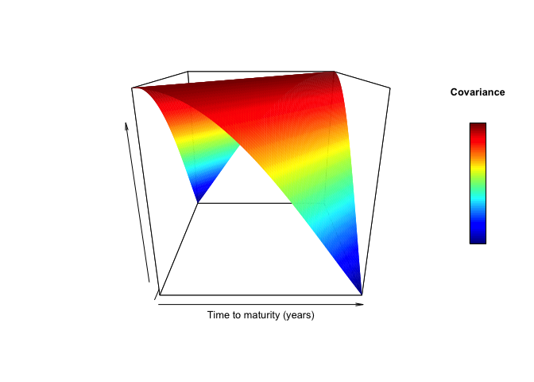

<!-- README.md is generated from README.Rmd. Please edit that file -->

# FDATSM

<!-- badges: start -->

The R package `FDATSM` enables quantitative analysis of covariations of
difference returns as described in the articles [**Robust Functional
Data Analysis for Stochastic Evolution Equations in Infinite
Dimensions**](https://arxiv.org/pdf/2401.16286) by [Dennis
Schroers](https://github.com/dschroers). The data inputs should be yield
or discount data over over a prespecified time span (e.g. a quarter, a
year, a decade) and an upper limit on the time to maturity (e.g. 5
years, 10 years, 30 years). The resolution of the data in time and time
to maturity should coincide (e.g. if data are available daily, the
corresponding yields or zero-coupon bond prices must be available in a
daily resolution in the maturity dimension). For the important case of
daily data, this necessitates smoothed discound or yield curves. In the
example presented below, we use data from … and … .  
The estimated covariations of difference returns correspond to rescaled
empirical covariances of difference returns and are provided in matrix
format. A jump truncation method is also available, corresponding to an
outlier robust estimator for the covariations.

<!-- badges: end -->

## Installation

You can install the development version of FDATSM from
[GitHub](https://github.com/) with:

``` r
# install.packages("devtools")
devtools::install_github("dschroers/FDASPDE")
```

## Simple Example with Simulated Data

Subsequently, a simple example for the analysis of covariations in the
bond market is presented:

``` r
library(FDATSM)
library(pracma)
## basic example code
```

The subsequent code generates samples difference returns in resolution
$n\times n$ (time and time to maturity) generated from instantaneous
forward curve model $$df_t = \partial_x f_t dt+ dX_t$$ where
$$X_t=  W_t^Q+ J_t$$ where $W^Q$ is a $Q$-Wiener process for a
covariance operator $Q$ given by an integral kernel operator with
integral kernel $q\in L^2([0,1]^2)$ taking the Gaussian form
$$q(x,y)= \exp(-10 (x-y)^2)$$ which can be plotted:

``` r
persp(z=  Gaussian.cov(.1,100,100)[1:100,1:100],xlab= "Time to maturity (years)", zlab = "", ylab = "")
```



The jump process $J$ is a compound Poisson process in $L^2(0,1)$ and is
given as $$J_t = \sum_{i=1}^{N_t}\chi_i,$$ where $N$ is a Poisson
process with intensity $\lambda>0$ and jumps $\chi\sim(N(0,C))$ for a
covariance operator $C$ in $L^2(0,1)$ given as an integral kernel
operator via the kernel $$c(x,y)\propto \exp(-x)\exp(-y)$$ such that
$\|c\|_{L^2([0,1]^2)}=1$.
